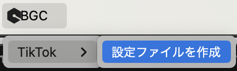
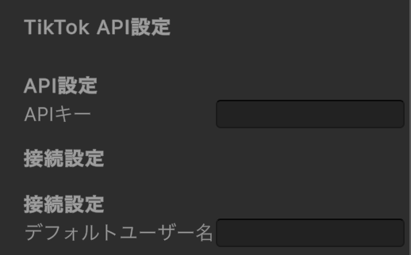

# BGC Unity Tool


BGC Unity 開発者専用ライブラリ

[](LICENSE.txt)  
[](https://unity.com/)

## 目次

- [機能](#機能)
- [インストール方法](#インストール方法)
- [API キーの設定](#apiキーの設定)
- [基本的な使い方](#基本的な使い方)
- [イベントハンドリング](#イベントハンドリング)
- [接続状態の管理](#接続状態の管理)
- [応用例](#応用例)
- [API リファレンス](#api-リファレンス)
- [トラブルシューティング](#トラブルシューティング)
- [ライセンス](#ライセンス)

---

## 機能

- **TikTok ライブ配信との WebSocket 接続**
- 各種イベントの受信と処理
  - **ギフト**受信イベント
  - **コメント**受信イベント
  - **いいね**受信イベント
  - **フォロー**受信イベント
  - **シェア**受信イベント
  - **サブスクライブ**受信イベント
  - **視聴者情報**受信イベント
- 接続状態の管理と監視
- エラーハンドリング
- UI との連携サンプル

---

## インストール方法

### Package Manager を使用する場合（推奨）

1. Unity Editor を開き、 **Window > Package Manager** を選択
2. 「+」ボタンをクリックし、「Add package from git URL...」を選択
3. 以下の URL を入力して「Add」をクリック

```
https://github.com/iy-tech-work/bgc-unity-tool.git?path=bgc.unity.tool/Packages/bgc.unity.tool
```
### 手動インストール（非推奨）

1. このリポジトリをクローンまたはダウンロード
2. `bgc.unity.tool/Packages/bgc.unity.tool` フォルダをプロジェクトの `Packages` フォルダにコピー

**注意:** 手動インストールは非推奨です。Package Manager を使用する方法が推奨されます。これは、Package Manager を使用することで、依存関係の管理や更新が簡単に行えるため、開発者の皆さんがスムーズにご対応いただけるためです。
---

## API キーの設定





1. Unity のツールバーから **BGC > TikTok > 設定ファイルを作成** を選択  
   → 自動的に `Assets/Resources/TikTokSettings.asset` が作成されます。
2. 作成されたアセットに API キーを設定してください。

スクリプトから以下のようにと見込めます

```csharp
// APIキーを設定
ApiKeyService.LoadApiKey();
```

---

## 基本的な使い方

具体的な実装は https://github.com/iy-tech-work/bgc-unity-tool/blob/main/bgc.unity.tool/Assets/Scenes/Connect.cs をご覧ください。

### 1. BgcTiktokWebSocket コンポーネントの追加

シーン内の GameObject に `BgcTiktokWebSocket` コンポーネントを追加します。

```csharp
// スクリプトから追加する場合
GameObject go = new GameObject("TikTokManager");
BgcTiktokWebSocket tiktokManager = go.AddComponent<BgcTiktokWebSocket>();
DontDestroyOnLoad(go); // シーン遷移時も保持
```

### 2. ユーザー名の設定と接続

```csharp
// ユーザー名を設定して接続
string username = "tiktok_username";
BgcTiktokWebSocket.Instance.SetUsername(username);
BgcTiktokWebSocket.Instance.Connect();
```

### 3. 切断処理

```csharp
// 切断
BgcTiktokWebSocket.Instance.Disconnect();
```

---

## イベントハンドリング

### 1. イベントハンドラの登録

以下のように、各種イベントハンドラを登録します。  
※ 実装例では、主にギフト、チャット、いいね、視聴者情報、シェア、フォロー、サブスクライブ、接続エラーを処理しています。

```csharp
// イベントハンドラを登録
BgcTiktokWebSocket.OnGiftReceived     += HandleGiftReceived;
BgcTiktokWebSocket.OnChatReceived     += HandleChatReceived;
BgcTiktokWebSocket.OnLikeReceived     += HandleLikeReceived;
BgcTiktokWebSocket.OnRoomUserReceived += HandleRoomUserReceived;
BgcTiktokWebSocket.OnConnectionError  += HandleConnectionError;
BgcTiktokWebSocket.OnShareReceived    += HandleShareReceived;
BgcTiktokWebSocket.OnFollowReceived   += HandleFollowReceived;
BgcTiktokWebSocket.OnSubscribeReceived += HandleSubscribeReceived;
```

### 2. イベントハンドラの実装例

#### ギフトイベント

```csharp
private void HandleGiftReceived(GiftMessage giftMessage)
{
    string userId    = giftMessage.userId;
    string nickname  = giftMessage.nickname;
    string giftName  = giftMessage.giftName;
    int diamondCount = giftMessage.diamondCount;
    int executionCount = giftMessage.executionCount;

    Debug.Log($"{nickname}さんから{giftName}（{diamondCount}ダイヤ）を受け取りました！実行回数: {executionCount}");

    ExecuteGiftAction(nickname, giftName, diamondCount, executionCount);
}

private void ExecuteGiftAction(string nickname, string giftName, int diamondCount, int executionCount)
{
    for (int i = 0; i < executionCount; i++)
    {
        Debug.Log($"アクション実行 [{i+1}/{executionCount}]: {nickname}さんの{giftName}（{diamondCount}ダイヤ）");

        // ここに実際のアクションを実装
        // 例: 効果音を鳴らす、エフェクトを表示する、ゲーム内アイテムを生成するなど
    }
}
```

#### コメントイベント

```csharp
private void HandleChatReceived(ChatMessage chatMessage)
{
    string userId   = chatMessage.userId;
    string nickname = chatMessage.nickname;
    string comment  = chatMessage.comment;

    Debug.Log($"💬 {nickname} (@{userId}): {comment}");

    // チャットメッセージの表示や追加処理
    AddChatMessage($"{nickname} (@{userId}): {comment}");
    UpdateChatUI();
    AddChatLogItem(userId, nickname, chatMessage.uniqueId, comment);
}
```

#### いいねイベント

```csharp
private void HandleLikeReceived(LikeMessage likeMessage)
{
    Debug.Log($"👍 {likeMessage.nickname}さんから{likeMessage.likeCount}いいねを受け取りました！ 累計: {likeMessage.totalLikeCount}");
    UpdateLikeCountUI(likeMessage.totalLikeCount);
}
```

#### 視聴者情報イベント

```csharp
private void HandleRoomUserReceived(RoomUserMessage roomUserMessage)
{
    int viewerCount = roomUserMessage.viewerCount;
    UpdateViewerCountUI(viewerCount);
    Debug.Log($"👁 視聴者数: {viewerCount}人");
}
```

#### シェアイベント

```csharp
private void HandleShareReceived(ShareMessage shareMessage)
{
    if (shareMessage == null)
    {
        Debug.LogError("シェアメッセージがnullです");
        return;
    }
    Debug.Log($"シェアイベントを受信しました: {shareMessage.userId}, {shareMessage.nickname}");
    AddChatLogItem(shareMessage.userId, shareMessage.nickname, shareMessage.uniqueId, $"{shareMessage.nickname}さんがライブをシェアしました！");
}
```

#### フォローイベント

```csharp
private void HandleFollowReceived(FollowMessage followMessage)
{
    if (followMessage == null)
    {
        Debug.LogError("フォローメッセージがnullです");
        return;
    }
    Debug.Log($"フォローイベントを受信しました: {followMessage.userId}, {followMessage.nickname}");
    AddChatLogItem(followMessage.userId, followMessage.nickname, followMessage.uniqueId, $"{followMessage.nickname}さんがライブ配信者をフォローしました！");
}
```

#### サブスクライブイベント

```csharp
private void HandleSubscribeReceived(SubscribeMessage subscribeMessage)
{
    if (subscribeMessage == null)
    {
        Debug.LogError("サブスクライブメッセージがnullです");
        return;
    }
    Debug.Log($"サブスクライブイベントを受信しました: {subscribeMessage.userId}, {subscribeMessage.nickname}, サブスク月数: {subscribeMessage.subMonth}ヶ月目");
    AddChatLogItem(subscribeMessage.userId, subscribeMessage.nickname, subscribeMessage.uniqueId, $"{subscribeMessage.nickname}さんが配信者にサブスクライブしました！");
}
```

---

## 接続状態の管理

### 接続状態の監視

```csharp
private void UpdateConnectionStatus()
{
    if (BgcTiktokWebSocket.Instance.IsConnected || BgcTiktokWebSocket.Instance.IsConnecting)
    {
        statusText.text  = "接続状態: 接続中";
        statusText.color = connectedColor; // オレンジ
    }
    else if (BgcTiktokWebSocket.Instance.IsDisconnecting)
    {
        statusText.text  = "接続状態: 切断中";
        statusText.color = disconnectingColor; // 赤
    }
    else
    {
        statusText.text  = "接続状態: 未接続";
        statusText.color = notConnectedColor; // 白
    }
}
```

### 接続エラーの処理と自動再接続例

```csharp
private void HandleConnectionError(string errorMessage)
{
    ShowErrorMessage(errorMessage);

    // 自動再接続が有効の場合、一定時間後に再接続を試みる
    if (shouldAutoReconnect)
    {
        StartCoroutine(TryReconnect());
    }
}

private IEnumerator TryReconnect()
{
    yield return new WaitForSeconds(reconnectDelay);
    BgcTiktokWebSocket.Instance.Reconnect();
}
```

---

## 応用例

### ギフトに応じたゲーム内アクション

```csharp
private void HandleGiftReceived(GiftMessage giftMessage)
{
    switch (giftMessage.giftName)
    {
        case "ローズ":
            SpawnRoses(giftMessage.repeatCount);
            break;
        case "ロケット":
            LaunchRocket();
            break;
        case "ユニバース":
            PlaySpecialEffect("Universe");
            AddBonusPoints(1000);
            break;
        default:
            PlayDefaultGiftAnimation();
            break;
    }
}
```

### コメントコマンドシステム

```csharp
private void HandleChatReceived(ChatMessage chatMessage)
{
    string comment = chatMessage.comment.ToLower();

    // コマンドの処理（"!"で始まるコマンド）
    if (comment.StartsWith("!"))
    {
        string command = comment.Substring(1).Split(' ')[0];

        switch (command)
        {
            case "dance":
                PlayCharacterAnimation("Dance");
                break;
            case "jump":
                PlayCharacterAnimation("Jump");
                break;
            case "color":
                string[] parts = comment.Split(' ');
                if (parts.Length > 1)
                {
                    ChangeColor(parts[1]);
                }
                break;
        }
    }
}
```

### 視聴者参加型ゲーム

```csharp
private Dictionary<string, Player> viewers = new Dictionary<string, Player>();

private void HandleChatReceived(ChatMessage chatMessage)
{
    string userId  = chatMessage.userId;
    string comment = chatMessage.comment;

    // 新規視聴者の登録
    if (!viewers.ContainsKey(userId))
    {
        viewers[userId] = CreateNewPlayer(userId, chatMessage.nickname);
    }

    // コメントに基づいてプレイヤーの動作を操作
    if (comment.Contains("左"))
    {
        viewers[userId].MoveLeft();
    }
    else if (comment.Contains("右"))
    {
        viewers[userId].MoveRight();
    }
    else if (comment.Contains("ジャンプ"))
    {
        viewers[userId].Jump();
    }
}
```

---

## API リファレンス

### BgcTiktokWebSocket

TikTok WebSocket との接続を管理するメインコンポーネント。

**プロパティ**

- `IsConnected`: 接続状態を取得します。

**メソッド**

- `SetUsername(string username)`: TikTok のユーザー名を設定します.  
  _使用例:_
  ```csharp
  BgcTiktokWebSocket.Instance.SetUsername("tiktok_username");
  ```
- `Disconnect()`: WebSocket 接続を切断します.  
  _使用例:_
  ```csharp
  BgcTiktokWebSocket.Instance.Disconnect();
  ```
- `Reconnect()`: WebSocket 接続を再接続します.

**イベント**

- `OnGiftReceived`: ギフト受信時に発火するイベント.
- `OnChatReceived`: チャット受信時に発火するイベント.
- `OnLikeReceived`: いいね受信時に発火するイベント.
- `OnRoomUserReceived`: 視聴者情報受信時に発火するイベント.
- `OnShareReceived`: シェア受信時に発火するイベント.
- `OnFollowReceived`: フォロー受信時に発火するイベント.
- `OnSubscribeReceived`: サブスクライブ受信時に発火するイベント.
- `OnConnectionError`: 接続エラー発生時に発火するイベント.

### TiktokWebSocketManager

WebSocket の接続管理を行うシングルトンコンポーネント。

**プロパティ**

- `Instance`: シングルトンインスタンスを取得します.
- `IsConnected`: 接続状態を取得します.
- `IsConnecting`: 接続処理中かどうかを取得します.
- `IsDisconnecting`: 切断処理中かどうかを取得します.

**メソッド**

- `Connect()`: WebSocket サーバーに接続します.
- `Disconnect()`: WebSocket サーバーから切断します.
- `SetUsername(string username)`: ユーザー名を設定します.

### メッセージモデル

#### GiftMessage

- `userId`: ユーザー ID
- `nickname`: ニックネーム
- `giftName`: ギフト名
- `diamondCount`: ダイヤモンド数
- `repeatCount`: 連続送信回数
- `repeatEnd`: 連続送信終了フラグ
- `giftPictureUrl`: ギフト画像の URL
- `isSubscriber`: サブスクライブ加入者かどうか
- `executionCount`: 実行回数

#### ChatMessage

- `userId`: ユーザー ID
- `nickname`: ニックネーム
- `comment`: コメント内容
- `uniqueId`: ユニークな識別子

#### LikeMessage

- `userId`: ユーザー ID
- `nickname`: ニックネーム
- `likeCount`: いいね数
- `totalLikeCount`: 累計いいね数

#### SubscribeMessage

- `userId`: ユーザー ID
- `nickname`: ニックネーム
- `subMonth`: サブスクライブ月数
- `oldSubscribeStatus`: 以前のサブスクライブ状態
- `subscribingStatus`: 現在のサブスクライブ状態
- `uniqueId`: ユニークな識別子

---

## トラブルシューティング

### 接続できない場合

1. API キーが正しく設定されているか確認してください.
2. ユーザー名が正しく設定されているか確認してください.
3. インターネット接続を確認してください.
4. ファイアウォールやプロキシの設定を確認してください.

### イベントが受信されない場合

1. イベントハンドラが正しく登録されているか確認してください.
2. 接続状態を確認してください.
3. TikTok ライブ配信が実際に行われているか確認してください.

### メモリリークが発生する場合

- イベントハンドラの解除を必ず行ってください.
  _例:_
  ```csharp
  private void OnDestroy()
  {
      BgcTiktokWebSocket.OnGiftReceived     -= HandleGiftReceived;
      BgcTiktokWebSocket.OnChatReceived     -= HandleChatReceived;
      BgcTiktokWebSocket.OnLikeReceived     -= HandleLikeReceived;
      BgcTiktokWebSocket.OnRoomUserReceived -= HandleRoomUserReceived;
      BgcTiktokWebSocket.OnConnectionError  -= HandleConnectionError;
      BgcTiktokWebSocket.OnShareReceived    -= HandleShareReceived;
      BgcTiktokWebSocket.OnFollowReceived   -= HandleFollowReceived;
      BgcTiktokWebSocket.OnSubscribeReceived -= HandleSubscribeReceived;
  }
  ```

---

## ライセンス

このプロジェクトは [MIT License](LICENSE.txt) の下で公開されています.  
詳細は LICENSE.txt をご確認ください.
